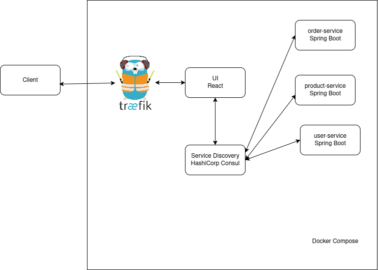

<h1>E-Shop project</h1>

<h2>Overview</h2>

Project is build by using microserivce architecure.
Each microservice is implemented as Spring Boot project.

<h2>Tech Stack</h2>
<ul>
    <li>Java 21</li>
    <li>Spring Boot 3</li>
    <li>Kafka</li>
    <li>PostgreSQL</li>
    <li>MongoDB</li>
    <li>Docker</li>
    <li>Traefik</li>
    <li>HashiCorp Consul</li>
    <li>Prometheus</li>
    <li>Grafana</li>
    <li>Elasticsearch</li>
    <li>Kibana</li>
</ul>
<h2>Documentations</h2>
<ul>
    <li>User microservice - <a href="./docs/user-service/README.md">here</a></li>
    <li>Order microservice - <a href="./docs/order-service/README.md">here</a></li>
    <li>Product microservice - <a href="./docs/product-service/README.md">here</a></li>
</ul>

<h2>Architecture Diagram</h2>
