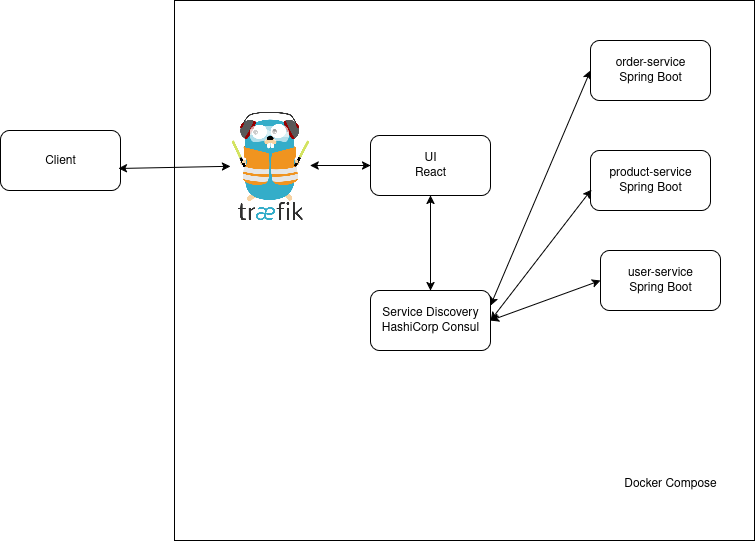

# E-Shop — Microservices Platform

A backend e-commerce platform built with a microservice architecture. Each service is independently deployable, communicates via Kafka for async events, and registers itself dynamically with Traefik through Consul — no static routing configuration required.

## Functional Requirements

### User Service
- Register a new user account
- Authenticate a user and issue a session token
- Retrieve user profile information

### Product Service
- List all available products
- Create a new product with name, description, price, and stock quantity
- Retrieve a single product by ID

### Order Service
- Place a new order for a product with a specified quantity
- Publish an order-created event so downstream services can react asynchronously
- Retrieve the list of all orders (query side, CQRS)

## Non-Functional Requirements

### Observability
- Prometheus metrics exposed on every service via `/actuator/prometheus`
- Centralised log aggregation with Fluent Bit, Elasticsearch, and Kibana
- Grafana dashboards for real-time service health and throughput monitoring

## Architecture



## Tech Stack

- Java 21
- Spring Boot 3.5
- Spring Cloud 2025
- PostgreSQL
- MongoDB
- Apache Kafka
- HashiCorp Consul
- Traefik
- Prometheus
- Grafana
- Elasticsearch
- Kibana
- Fluent Bit
- Docker

## Usage

**Prerequisites:** Docker and Docker Compose

Create an `.env` file inside `infrastructure/` with the required variables (see each service's docs for details), then run:

```bash
cd infrastructure

# Development — debug logging, no observability
docker compose -f docker-compose-dev.yaml up

# Production — full stack with observability
docker compose up
```

## Documentations

- User microservice — [docs](./docs/user-service/README.md)
- Order microservice — [docs](./docs/order-service/README.md)
- Product microservice — [docs](./docs/product-service/README.md)
