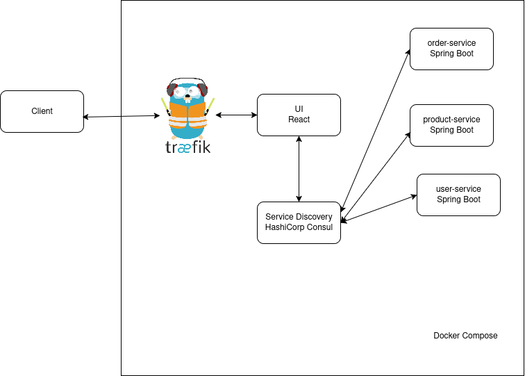

# E-Shop — Microservices Platform

A backend e-commerce platform built with a microservice architecture. Each service is independently deployable, communicates via Kafka for async events, and registers itself dynamically with Traefik through Consul — no static routing configuration required.

## Functional Requirements

### User Service
- Register a new user account
- Authenticate a user and issue a session token
- Retrieve user profile information

### Product Service
- List all available products
- Create a new product with name, description, price, and stock quantity
- Retrieve a single product by ID

### Order Service
- Place a new order for a product with a specified quantity
- Publish an order-created event so downstream services can react asynchronously
- Retrieve the list of all orders (query side, CQRS)

## Non-Functional Requirements

### Observability
- Prometheus metrics exposed on every service via `/actuator/prometheus`
- Centralised log aggregation with Fluent Bit, Elasticsearch, and Kibana
- Grafana dashboards for real-time service health and throughput monitoring

## Architecture



## Tech Stack

- Java 21
- Spring Boot 3.5
- Spring Cloud 2025
- PostgreSQL
- MongoDB
- Apache Kafka
- HashiCorp Consul
- Traefik
- Prometheus
- Grafana
- Elasticsearch
- Kibana
- Fluent Bit
- Docker

## Usage

**Prerequisites:** Docker and Docker Compose

Create an `.env` file inside `infrastructure/` with the required variables (see each service's docs for details), then run:

```bash
cd infrastructure

# Development — debug logging, no observability
docker compose -f docker-compose-dev.yaml up

# Production — full stack with observability
docker compose up
```

## Design Decisions

**CQRS in the order service.** Orders are written to PostgreSQL and simultaneously projected into MongoDB as a read model. The write side owns consistency; the read side is optimised for queries without joins or locking contention. This makes the query path independently scalable and keeps the write path simple.

**Kafka for async communication.** When an order is placed the service publishes an event instead of calling downstream services directly. This keeps services decoupled — a slow or unavailable consumer does not block the order write path, and new consumers can be added without changing the order service.

**Self-hosted OAuth2 Authorization Server.** The user service runs Spring Authorization Server and issues signed JWT access tokens. Other services validate tokens locally using the public key fetched once from the JWK endpoint — no per-request round-trip to the auth server. Two OAuth2 clients are registered: `client_credentials` for service-to-service calls and `authorization_code + PKCE` for the SPA frontend.

**Consul for service discovery.** Each service registers itself in Consul at startup and exposes a health-check endpoint. Consul acts as the central registry, so no service needs to know the address of another at deploy time — they resolve each other by name through the registry.

**Centralized configuration via Consul KV.** Non-secret config lives in Consul's key-value store instead of each service's local yaml configuration file. Every service loads two keys at startup: a shared **config/application** key common to all services (Kafka bootstrap address, management endpoint exposure, Sentry tracing defaults) and its own **config/{service-name}** key for values specific to that service (server port, JPA/Hibernate settings, Kafka consumer/producer settings, Sentry log level). This means common settings are defined once instead of duplicated across services and any of these values can be changed and picked up without a rebuild. Secrets and connection bootstrap info (DB credentials, the Consul address itself) stay in environment variables, since a service needs those to locate Consul before it can pull anything from it.

**Traefik as the API gateway.** Traefik watches Consul and builds its routing table dynamically from the tags each service registers. It handles path-based routing, load balancing across instances, and TLS termination without any static configuration. Adding or removing a service instance requires no change to the gateway.

**Rate limiting at the gateway.** Each service route has a token bucket rate limiter defined in Traefik's dynamic config. The bucket refills at a fixed rate and allows short bursts above it — once the bucket is empty, requests get a 429 until it refills. The limit is per client IP and per route, so hitting `/api/v1/products` doesn't affect the budget for `/api/v1/orders`. Note: Traefik has no JWT awareness, so limiting per authenticated user isn't possible at this layer. That would require either implementing it inside each service or using a Redis-backed shared counter keyed by the JWT `sub` claim, which keeps the logic centralised and consistent across all instances.

## Known Limitations / Future Work

- **No Kafka schema registry.** *(Pending)* Event payloads are plain JSON, and each service defines its own copy of the record shape it consumes or produces — there's no shared schema or compatibility check, so a producer and consumer can drift silently. Introducing a schema registry (Avro or Protobuf-backed, e.g. Confluent Schema Registry) would enforce compatibility across services.
- **No refund compensation in the order saga.** *(Pending)* If stock reservation fails after payment already succeeded, the order is marked failed but the payment isn't refunded. This is the next step on top of the orchestrator's payment step.
- **No real payment processor.** *(Pending)* Payment-service currently records a payment and always succeeds — there's no integration with an actual payment provider yet. Stripe is the planned candidate (the SDK is already a dependency).
- **Consumers aren't idempotent outside inventory-service.** *(Pending)* `@RetryableTopic` gives at-least-once delivery, but the order-service and payment-service consumers don't dedupe redelivered messages — only inventory-service's `reserveStock` does, via `ProcessedOrderEvent`. A retry after a partial failure could double-update an order or double-publish an event.
- **Per-user rate limiting isn't possible at the gateway.** *(Pending)* Traefik has no JWT awareness, so limiting is IP-based only. A JWT-`sub`-keyed limit would need a Redis-backed counter in each service.
- **No integration with product-service for price.** *(Pending)* The order amount is client-supplied with no check against product-service's actual price — a security problem, since a client can send an arbitrary amount for a given product and quantity. Will be implemented.
- **Dead-letter handling is log-only.** *(Pending)* Messages that exhaust Kafka retries land on the DLT and get logged, nothing more — no alerting, no persisted record, no replay mechanism. For payment-related consumers especially, this means a stuck message has no visibility beyond grepping logs.

## Documentations

- User microservice — [docs](./docs/user-service/README.md)
- Order microservice — [docs](./docs/order-service/README.md)
- Product microservice — [docs](./docs/product-service/README.md)
